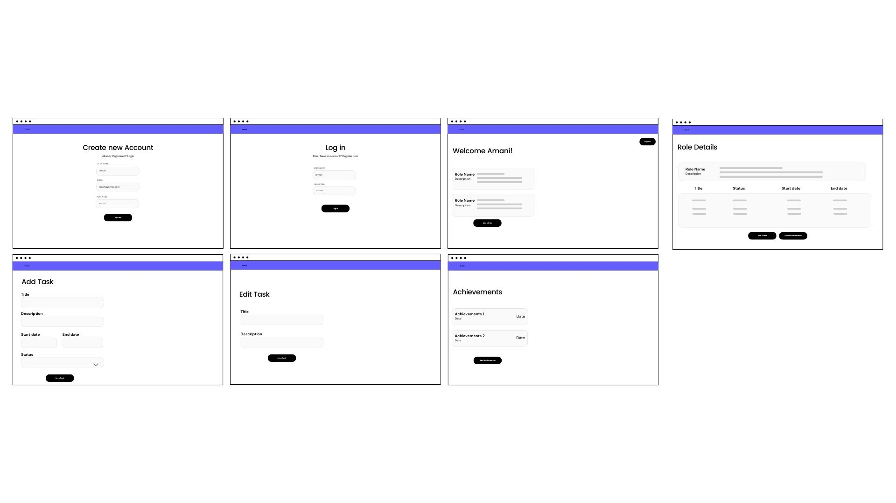
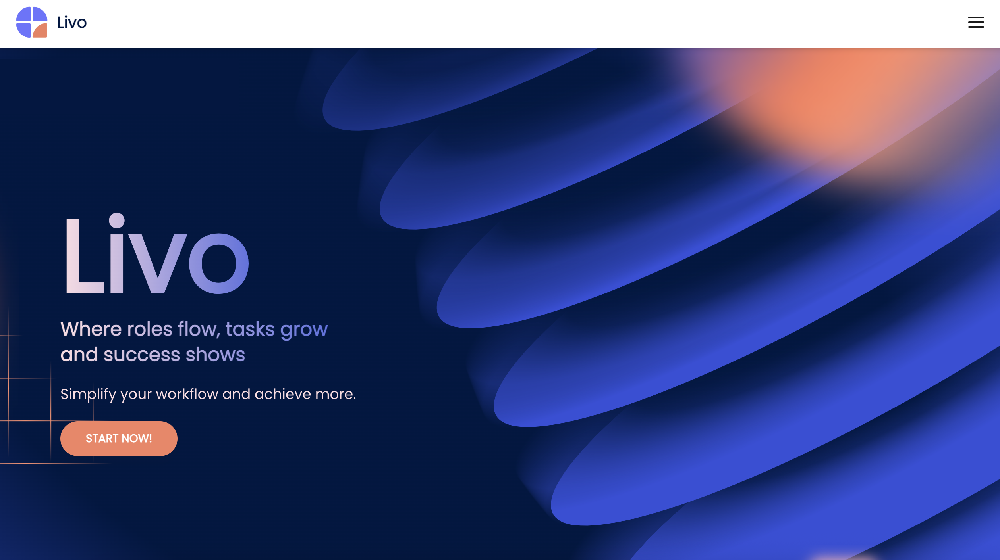
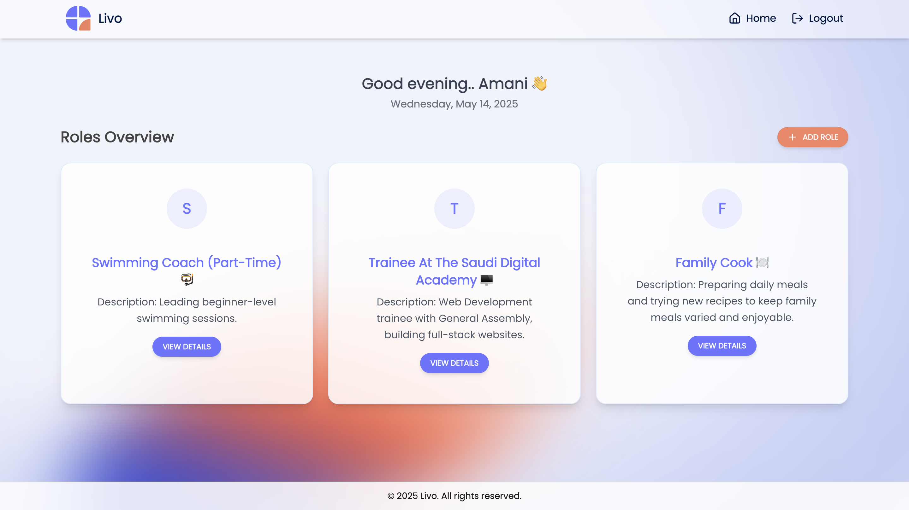
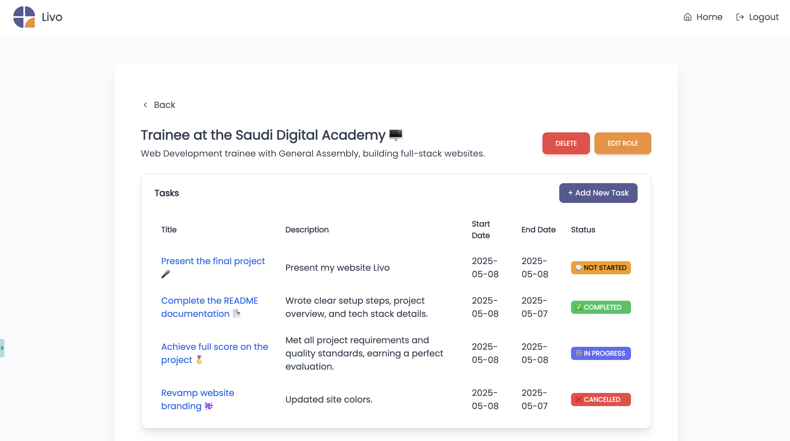
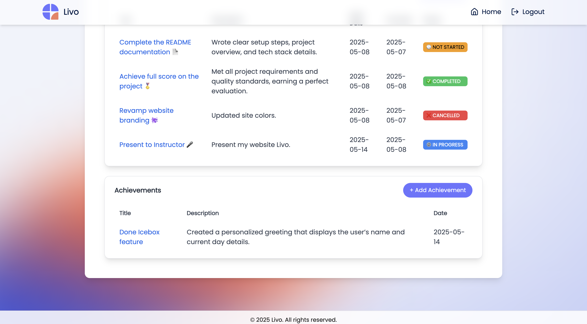

# Livo Frontend

**Livo** is a web application designed to streamline personal productivity by allowing users to manage **roles**, assign **tasks**, and track **achievements** in a clear and structured way.

----

## Tech Stack

*   **React.js** – JavaScript library for building user interfaces  
*   **React Router** – Routing management
*   **Axios** – HTTP client for API communication    
*   **Tailwind CSS** – Utility-first CSS framework for styling     
*   **Vite** – Fast build tool for modern frontend development

----

## Backend Repository

You can find the backend repository here:  
[https://git.generalassemb.ly/amani/livo-backend](https://git.generalassemb.ly/amani/livo-backend)

----

## Installation Instructions

### 1\. Clone this repository

git clone [https://git.generalassemb.ly/amani/livo-frontend.git](https://git.generalassemb.ly/amani/livo-frontend.git)  
cd livo-frontend

### 2\. Install dependencies

npm install

### 3\. Create an environment variable file

touch .env

Then add your API base URL:

VITE\_BASE\_URL=http://127.0.0.1:8000/api

### 4\. Run the development server

npm run dev

----

## Screenshots

### Wireframe

### Home Page

### Role Detail

### Task List

### Achievement List

----

## IceBox Features

*   Calendar integration for task deadlines     
*   Drag-and-drop interface for reordering tasks    
*   Dark mode theme toggle    
*   Notifications for upcoming tasks or achievements    
*   Ability to share roles with other users

----

## Resources

*   https://tailwindcss.com
*   https://www.material-tailwind.com/
*   https://lucide.dev/icons/
*   https://webgradients.com/
*   https://www.canva.com/
*   https://logo.com/  
